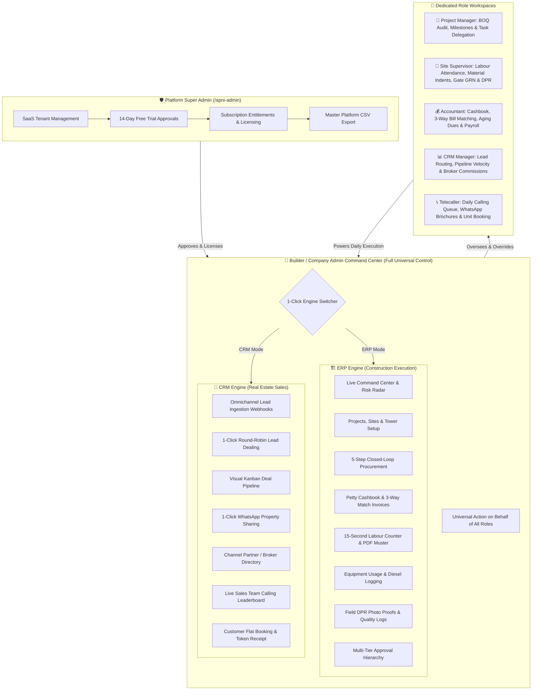
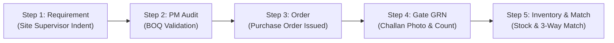
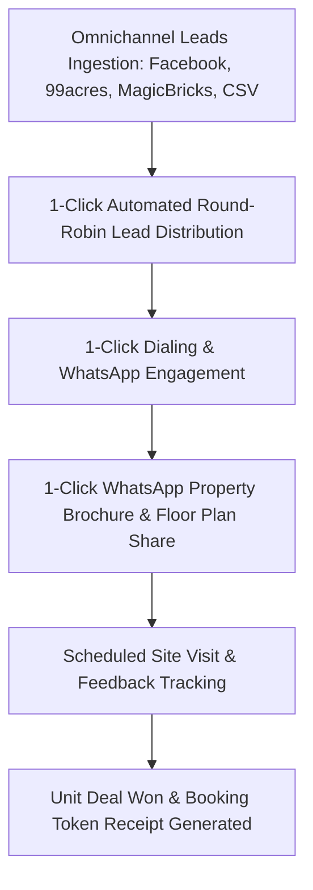

# Apniestate — Complete User Journey & Walkthrough Operating Manual
### *A Plain-English, Step-by-Step Operating Guide for Demo Video Creators, Real Estate Builders, Project Managers, Site Engineers, Accountants, CRM Managers, and Telecallers*

---

## Executive Summary & Document Purpose

This operating manual is written in **simple, sensible, non-technical words**. It is designed specifically so that anyone—even a non-technical person or a video creator who has never seen construction management or real estate software before—can effortlessly understand every screen, know exactly which buttons to touch during a demo video, explain the concrete business benefits to any client or investor, and see how the Builder retains 100% operational sovereignty to act on behalf of any absent field role.

---

## 1. Executive System Overview (The Big Picture)

**Apniestate** is an all-in-one cloud platform that unifies **On-Ground Construction Project Execution (ERP)** with **Real Estate Sales & Lead Management (CRM)** under a single database.

In traditional real estate and construction companies, daily operations are chaotic because teams juggle 5 disconnected tools:
1. **WhatsApp groups** for attendance and material orders (where messages get buried).
2. **Paper muster rolls** for site labour (leading to ghost workers and inflated wage theft).
3. **Loose Excel sheets** for milestone tracking and BOQ budgets.
4. **Physical paper bills** that reach the accountant 3 weeks late (causing duplicate payments).
5. **Paper diaries or personal phone contacts** for property buyer leads (causing 40% to 60% lead leakage).

**Apniestate replaces all 5 disconnected tools with a single unified platform.**

### The 1-Click Dual-Engine Switcher
Look at the top of the left sidebar. There is a sleek pill toggle labeled **[ERP]** and **[CRM]**.
- Touching **[CRM]** transforms the entire sidebar into the Real Estate Sales Workspace with zero page reloads.
- Touching **[ERP]** instantly switches back to Construction & Site Engineering.
*In demo videos, always showcase this toggle—it proves that the builder gets two enterprise platforms in one!*

---

## 2. Core Superpowers: Why This Platform Impresses Everyone

When recording or demonstrating Apniestate, emphasize these **5 Standout Superpowers**:

1. **Live Project Command Center & Automated Risk Radar**:
   - Scans the project in real time: displays the exact remaining budget balance, today's labour wage liability, interactive low-stock reorder warnings, procurement delay alarms, and BOQ material usage variance.
2. **15-Second Labour Counter & Instant Daily Wage Muster**:
   - Visual cards with icons (Mistri 🧱, Carpenter 🪚, Helper 👷, Electrician ⚡). Supervisor taps `[+]` or `[-]` counters for Present, Half Day, and OT Hours. The system calculates the wage cost immediately and generates an official printable muster roll PDF with one click.
3. **5-Step Closed-Loop Procurement Protection (Zero Fraud)**:
   - Eliminates fake bills and missing cement: Site Supervisor Indent $
ightarrow$ PM Technical Audit $
ightarrow$ Official PO $
ightarrow$ Gate GRN Physical Delivery Inspection with Challan Photo $
ightarrow$ 3-Way Match Payment.
4. **Omnichannel Real Estate CRM & 1-Click WhatsApp Property Sharing**:
   - Ingests leads from Facebook, 99acres, and MagicBricks; deals them out via algorithmic Round Robin; lets telecallers share floor plans and brochures directly to customer WhatsApp in 2 seconds.
5. **Universal Builder "Action on Behalf of Any Role" Superpower**:
   - The Builder can step into any field supervisor's, accountant's, or telecaller's shoes to record attendance, approve POs, or reassign leads on the fly.

---

## 3. Platform Super Admin Panel (`/apni-admin`)

- **URL Route**: `/apni-admin/login` and `/apni-admin/dashboard`
- **Target Audience**: SaaS Platform Operators & Central Administrators

### Screen Walkthrough & Buttons to Touch
1. **Platform KPI Counters**: View Total Registered Builders, Active Paid Subscriptions, Active Free Trials, and Pending Approvals.
2. **Filter Tabs**: Touch `[PENDING]` to see newly registered builders waiting for verification.
3. **Approve Trial Button (Green Checkmark)**: Touching this button instantly activates a 14-day free trial for the builder, granting access to both ERP and CRM workspaces.
4. **Reject Trial Button (Red Cross)**: Rejects spam or unverified signups.
5. **Export CSV Button**: Located in the top right. Downloads a complete master spreadsheet of all registered companies, owner phones, GST details, and billing statuses.

> [!TIP]
> **Video Creator Tip**: Show the Super Admin dashboard for 10 seconds to show that every tenant company is verified with enterprise security and centralized licensing.

---

## 4. Builder & Company Admin Journey (Master Panel)

The Builder / Company Admin holds universal authority across all projects, finances, sites, and sales.

### 4.1 Global Navigation & Header Controls
- **Project Switcher Dropdown**: Located at the top left header. Clicking opens a list of company construction projects (e.g. 'Emerald Heights Phase 1'). Selecting a project instantly recalculates the entire dashboard for that project.
- **Status Badges**: Visual health indicators: `PLANNING` (Blue), `ACTIVE` (Emerald Green), `ON HOLD` (Amber), `COMPLETED` (Slate).
- **ERP / CRM Mode Toggle Pill**: Switch between site construction and real estate sales with zero reloads.
- **Floating Action Button (FAB)**: Touching the circular button in the bottom right reveals 6 instant shortcuts: `[Create Project]`, `[Create Task]`, `[Mark Attendance]`, `[Create DPR]`, `[Record Expense]`, and `[Req Material]`.

---

### 4.2 Screen 1: Project Command Center (`/dashboard`)
The daily executive pulse of the construction company:
- **Progress Hero Card**: Displays overall completion % (e.g. `42%`), budget spent vs total budget (e.g. `₹1.8 Cr of ₹4.5 Cr used`), remaining budget pill (`Rem: ₹2.7 Cr`), local site weather (`32°C Clear`), and targeted completion date.
- **Today's Pulse Row**: Three cards: (1) `Workers Today` (headcount on site), (2) `Today's Spend` (cash outlay), and (3) `Pending Material` (requisitions awaiting approval).
- **Project Intelligence Hub**:
  - `Remaining Budget`: Real-time spend headroom.
  - `Today's Labour Cost`: Wage liability calculated from morning attendance.
  - `Payments Due`: Unpaid vendor invoices awaiting disbursement.
- **Interactive Risk Warnings**:
  - `Low Stock Reorder Warning`: Amber card alerting when cement or steel drops below safe levels. *Touching this card jumps directly to the inventory reorder screen!*
  - `Procurement Delay Warning`: Red card alerting when vendor orders are past their promised delivery date.
  - `Milestone Delay Warning`: Rose card alerting when milestones exceed target dates.
  - `Material Usage vs BOQ Planned`: Progress bars comparing actual materials used on site against engineering limits. Bars turn red when exceeding 90%.
- **Needs Attention Cards**: Direct 1-click links to `[Material Requests Pending]`, `[Vendor Payments Due]`, and `[Attendance Not Submitted]`.
- **Quick Actions Grid**: Buttons for `[Add Expense]`, `[Material Request]`, `[Attendance]`, `[Daily Progress]`, `[Purchase]`, and `[Finance]`.

> [!NOTE]
> **Unique Benefit**: The Builder doesn't need to make 10 phone calls every morning. In 30 seconds on this screen, they know site attendance, daily spend, overdue payments, and delayed materials!

---

### 4.3 Screen 2: Projects Master & Project Detail Hub (`/projects` & `/projects/:id`)
- **'+ New Project' Button**: Opens modal to enter Project Name, Description, Start & End Dates, Budget in ₹, Status, Address, and City.
- **Project Detail Tabs**:
  1. `Overview`: Key dates, budget vs actual cost, assigned PM & Supervisor, and budget distribution pie chart.
  2. `Milestones`: Major construction stages, target deadlines, weights, and the `[+ Add Milestone]` button.
  3. `Sites`: Towers, blocks, or phases (Tower A, Club House). Shows supervisor and the `[+ Add Site]` button.
  4. `Tasks`: Task list by site and assignee, priority badges (`URGENT`, `HIGH`, `MEDIUM`), and the `[+ Add Task]` button.
  5. `Finance`: Category budget allocations (Materials, Labour, Equipment, Overhead, Subcontract) and the `[+ Add Budget]` button.
  6. `Timeline`: Interactive Gantt-style schedule tracker.
  7. `Units`: Real estate inventory catalog (Flat 101, Villa 4), carpet area, configuration (2BHK, 3BHK), price, status (Available, Booked, Sold), and the `[+ Add Unit]` button.

---

### 4.4 Screen 3: Procurement & Purchase Workspace (`/purchase`)
Features a 5-step visual workflow tracker bar: `[1. Requirement]` $
ightarrow$ `[2. PM Review]` $
ightarrow$ `[3. Order]` $
ightarrow$ `[4. Received]` $
ightarrow$ `[5. Inventory]`.

1. **BOQ (Bill of Quantities)**: Master engineering bill. Planned materials, planned quantities, estimated unit rates, total budget. Buttons: `[+ Add BOQ Item]`, `[Import BOQ from Excel]`, `[Export BOQ]`.
2. **Requirements (Material Requests)**: Site supervisor indents. Shows requested item, quantity, unit, urgency, site name. Action buttons: `[Approve]`, `[Modify Quantity]`, `[Reject]`, `[Convert to Order]`.
3. **Quotations**: Price quotes received from competing suppliers.
4. **Orders (Purchase Orders)**: Official POs with vendor name, total value, delivery date, and status. Touching `[+ Create Order]` generates a PO; touching `[Download PDF]` exports a branded purchase order.
5. **Received (Gate GRN Inspection)**: Incoming truck delivery log. Gate supervisor records delivered quantity, uploads a photo of the vendor's signed delivery challan, and touches `[+ Receive Goods]`.
6. **Inventory (Site Stock)**: Live stock on hand, units, minimum reorder thresholds, low stock alerts. Touching `[Consume Material]` logs daily consumption to a site tower.
7. **Vendors Master**: Directory of suppliers, phone numbers, GST, rating, and pending payment balances. Touching `[+ Add Vendor]` registers a new vendor.

---

### 4.5 Screen 4: Finance & Cashflow Workspace (`/finance`)
1. **Cashbook**: Site petty cash ledger. Opening balance, inflows (builder account transfers), outflows (site emergency expenses), closing balance. Touching `[+ Add Cash Entry]` logs Cash In / Out with voucher number and bill receipt photo.
2. **Expenses**: Master project expenditure log. Tracks expenses across categories with tax fields and bill attachments via `[+ Record Expense]`.
3. **Invoices**: Supplier bills and client invoices. Tracks invoice number, vendor, due date, amount, payment status (Paid, Partial, Unpaid). Touching `[+ Add Invoice]` registers a new bill.
4. **Budgets**: Visual progress bars comparing actual spend against approved budget caps for Materials, Labour, Equipment, Overhead, and Subcontract. Over-budget categories glow red.
5. **Dues (Vendor Payables)**: Aging analysis of vendor liabilities (0-30 Days, 30-60 Days, 60+ Days). Touching `[Pay Vendor]` opens the pre-filled payment disbursement modal.

---

### 4.6 Screen 5: Operations Workspace (`/operations`)
1. **Labour Register**: Daily worker roll call. Visual cards with icons: Mistri 🧱, Carpenter 🪚, Helper 👷, Electrician ⚡, Painter 🖌️, Plumber 🚰, Welder 🔥, Bar Bender 🏗️. Tap `[+]` and `[-]` counters for Present, Half Day, and OT Hours. Real-time wage liability calculation. Buttons: `[Save Today's Attendance]`, `[Export PDF]` (generates official muster roll), and `[+ Add Category]`.
2. **Equipment Register**: Heavy machinery tracker (JCB, Excavator, Crane, Concrete Mixer). Tracks daily working hours, idle hours, breakdown status, diesel fuel filled in litres, and operator name.

---

### 4.7 Screen 6: Field Progress & Daily Progress Reports (`/progress`)
1. **Timeline**: Gantt-style roadmap of project milestones.
2. **Milestones**: Milestone list with completion percentages and target dates.
3. **DPR (Daily Progress Report)**: Daily site diary. Supervisor selects site tower, types work summary, selects completion %, uploads 2-4 site photos, and touches `[Submit DPR]`.
4. **Calendar**: Interactive monthly calendar of work events and concrete pours.

---

### 4.8 Screen 7: Approval Center (`/approvals`)
- **Multi-Tier Hierarchies**: Level 1 (Supervisor Review) $
ightarrow$ Level 2 (PM Audit) $
ightarrow$ Level 3 (Builder Final Sanction).
- **Review Items**: Expenses, Purchase Orders, Material Requests, Leave Requests, Budget Overruns, Invoices.
- **Configure Chains Modal**: Customize approval chains per project.
- **Audit Logs**: Tamper-proof record of who approved what, when, and why.

---

### 4.9 Screen 8: User Management & Role Delegation (`/users`)
- **'+ Add User' Button**: Modal to enter Full Name, Email/Username, Password, Primary Role, Project Assignments, and CRM Sales Access toggle.
- **Manage Access Modal**: Reassign projects or update CRM permissions with zero delay.

---

### 4.10 Screen 9: Documents Vault & Milestone Analytics (`/documents` & `/reports`)
- **Documents Vault**: Cloud file repository organized into folders: Architectural CAD, Structural Drawings, Govt Approvals, Vendor Agreements, and Site Photos.
- **Reports & Analytics**: Cost vs Budget Variance, Labour Productivity, Material Wastage, and Milestone Velocity exportable to PDF and Excel.

---

### 4.11 Screen 10: Universal Builder Superpower — Action on Behalf of Any Role
- **Site Attendance Override**: Builder can open the Labour Register and mark worker attendance for any absent supervisor.
- **Emergency Material Requisitions**: Builder can raise material requests directly from the Command Center.
- **DPR Photo Uploads**: Builder can inspect sites and submit DPRs directly.
- **Financial Overrides**: Builder can record cash expenses or release vendor payments immediately.

---

## 5. Project Manager (PM) Journey

The Project Manager (PM) is the field commander ensuring the project finishes on time and on budget.

### Daily 6-Step Operating Rhythm
1. **08:30 AM — Command Center Check**: Open `/dashboard`. Check `[Workers Today]` headcount across masonry, carpentry, and electrical trades. Review weather conditions.
2. **10:00 AM — Material Indent Audit Against BOQ**: Open `/purchase?tab=requests`. Audit cement/steel requests from site supervisors. Compare against BOQ planned limits. Touch `[Modify Quantity]` to trim excess, then touch `[Approve]`.
3. **11:30 AM — Milestones & Task Delegation**: Open `/projects/:id`. Inspect `Milestones` and `Tasks`. If column casting is lagging, touch `[+ Add Task]`, set priority to `[URGENT]`, assign to supervisor with 24-hour deadline.
4. **02:00 PM — Document & Blueprint Verification**: Open `/documents`. Download latest structural CAD drawings to verify rebar schedules.
5. **05:30 PM — DPR Inspection & Photo Audit**: Open `/progress?tab=dpr`. Inspect photo proof submissions from site towers. Verify progress percentage claimed before signing off.
6. **06:30 PM — Level-2 Approval Clearance**: Open `/approvals`. Review petty cash vouchers and emergency contractor bills. Touch `[Approve]` to route to Builder for final release.

---

## 6. Site Supervisor (Site Engineer) Journey

The Site Supervisor manages physical site construction through a fast, mobile-first interface.

### The 5-Step Daily Field Routine
1. **08:00 AM — 15-Second Labour Roll Call**:
   - Open `/operations?tab=labour`.
   - Tap `[+]` on Mistri 🧱 (8), Helper 👷 (14), Carpenter 🪚 (4).
   - If workers worked overtime, tap `[+]` on OT Hours.
   - Wage cost updates in real time. Touch `[Save Today's Attendance]`. Touch `[Export PDF]` if paper muster roll is required.
2. **10:30 AM — Raising a Material Indent**:
   - Open `/purchase?tab=requests`. Touch `[+ New Request]`.
   - Select material (e.g. 'Grade 53 OPC Cement'), quantity ('100 Bags'), urgency (`HIGH`), delivery location ('Tower A'). Touch `[Submit Request]`.
3. **01:00 PM — Gate GRN Goods Inward Inspection**:
   - When delivery truck arrives, open `/purchase?tab=received`. Touch `[+ Receive Goods]`.
   - Select matching PO. Count physical bags unloaded. Enter delivered count.
   - Tap `[Upload Challan Photo]` to take a picture of the vendor's signed delivery slip with phone camera. Touch `[Confirm Receipt]`.
4. **03:30 PM — Machinery Usage & Diesel Logging**:
   - Open `/operations?tab=equipment`. Select JCB Excavator. Enter working hours ('6.5 hrs'), idle hours ('1 hr'), diesel filled ('40 Litres'). Touch `[Save Equipment Log]`.
5. **06:00 PM — End-of-Day DPR Submission**:
   - Open `/progress?tab=dpr`. Type work summary ('Cast 5th floor column group C; curing completed on 4th floor').
   - Select completion slider ('65%'). Tap `[Upload Photos]` to attach 2-4 site pictures. Touch `[Submit DPR]`.

---

## 7. Accountant Journey

The Accountant guarantees cashflow security, verifies bills through 3-way matching, and prevents financial leakage.

### The Step-by-Step Accounting Workflow
1. **Daily Petty Cashbook Ledger (`/finance?tab=cashbook`)**:
   - Review opening site cash.
   - When builder transfers funds, touch `[+ Add Cash Entry]` $
ightarrow$ select `[Cash In]`.
   - When site foreman buys emergency hardware, touch `[+ Add Cash Entry]` $
ightarrow$ select `[Cash Out]`, record voucher number, upload bill receipt. Closing cash recalculates instantly.
2. **3-Way Invoice Matching (`/finance?tab=invoices`)**:
   - Perform 3-way check: (1) Purchase Order rate $
ightarrow$ (2) Gate GRN delivered count and challan photo $
ightarrow$ (3) Vendor's physical bill.
   - Touch `[+ Add Invoice]`. Record invoice number, vendor, bill date, due date, taxable amount, GST breakdown. Upload bill PDF. Mark status as `[UNPAID]`.
3. **Master Expense Logging (`/finance?tab=expenses`)**:
   - Record site electricity, water charges, crane operator wages, soil testing fees with receipts via `[+ Record Expense]`.
4. **Vendor Dues & Aging Payment Disbursement (`/finance?tab=dues`)**:
   - Inspect aging table (0-30 Days, 30-60 Days, 60+ Days).
   - Touch `[Pay Vendor]` on approved bill. Select payment mode (NEFT/RTGS, Cheque, UPI), enter bank transaction reference, touch `[Record Payment]`. Vendor balance reduces automatically.
5. **Budget Monitoring (`/finance?tab=budgets`)**:
   - Inspect visual utilization bars to prevent any category from crossing approved financial caps before checks are written.

---

## 8. CRM & Leads Manager Journey

The CRM Manager drives sales velocity, eliminates lead leakage, and manages the broker network.

### The Step-by-Step CRM Leadership Workflow
1. **Omnichannel Ingestion & CSV Import (`/crm?tab=leads`)**:
   - Leads from Facebook Ads, 99acres, and MagicBricks flow into the database automatically.
   - For expo or walk-in leads, touch `[Import Leads]` to drag-and-drop Excel/CSV spreadsheets with automatic deduplication.
2. **Smart Automated Lead Distribution (Round Robin)**:
   - Touch `[Distribute Leads]`.
   - Choose **Round Robin** (deals out leads equally across active telecallers) or **Targeted Allocation** (assign high-budget inquiries to senior closers). Touch `[Assign Leads]`.
3. **Visual Kanban Pipeline Oversight (`/crm?tab=pipeline`)**:
   - Drag and drop deals across stages: `[New Lead]` $
ightarrow$ `[Contacted]` $
ightarrow$ `[Interested]` $
ightarrow$ `[Site Visit Scheduled]` $
ightarrow$ `[Site Visit Done]` $
ightarrow$ `[Negotiation]` $
ightarrow$ `[Deal Won]` $
ightarrow$ `[Lost]`.
4. **Channel Partner (Broker) Management (`/crm?tab=channel-partners`)**:
   - Touch `[+ Add Partner]`. Record Agency Name, Contact Person, Phone, RERA Number, and agreed commission % (e.g. '2.5%'). Track broker leads, closed deals, and pending brokerage payouts.
5. **Team Performance & Live Leaderboard (`/crm?tab=team`)**:
   - Monitor telecaller KPIs: Total Calls Made Today, Connect Rate %, Follow-ups Completed, Site Visits Booked, and Deals Closed.
6. **Marketing ROI Analytics (`/crm?tab=reports`)**:
   - Analyze which advertising sources generate actual buyers and inspect loss reasons.

---

## 9. Telecaller & Sales Executive Journey

The Telecaller is the frontline closer; calling leads, sharing property plans, and booking units.

### Daily Calling & Closing Workflow
1. **Start of Day Calling Queue (`/crm?tab=followups`)**:
   - Filter by `[Today's Calls]`, `[Overdue Follow-ups]`, and `[Upcoming]`.
2. **1-Click Calling & WhatsApp Engagement**:
   - Click on lead card. Touch blue `[Call]` phone icon to dial immediately; touch green `[WhatsApp]` chat icon to open chat.
3. **Logging Outcome & Setting Reminders**:
   - Select call outcome: `[Interested]`, `[Call Back Later]`, `[Ringing - No Answer]`, `[Budget Mismatch]`, `[Site Visit Requested]`.
   - Set next follow-up date/time in calendar picker. Type notes (e.g. 'Looking for 3BHK East-facing unit on 7th floor'). Touch `[Save Follow-up]`.
4. **1-Click WhatsApp Property Sharing (`/crm?tab=properties`)**:
   - Open Properties Catalog. Select unit (e.g. 'Tower A - Unit 702 - 3BHK').
   - Touch green `[Share via WhatsApp]` button. WhatsApp opens with prefilled message containing floor plan layout, carpet area, amenities list, and pricing sheet link!
5. **Booking a Site Visit (`/crm?tab=activities`)**:
   - When buyer agrees to visit project, touch `[+ Add Activity]` $
ightarrow$ `[Site Visit]`. Set date, time, family members, and pickup requirement.
6. **Closing the Deal & Booking the Unit (`/crm?tab=customers`)**:
   - When buyer pays token amount, touch `[+ Add Deal]`.
   - Select lead name, unit number ('Tower A - Flat 702'), agreed price, token received ('₹2,00,000'), and payment plan.
   - Touch `[Save Deal]`. Unit switches from 'Available' to 'Booked' in master inventory, deal moves to `[WON]`, and booking receipt is generated!

---

## 10. Master Permissions & Capabilities Matrix

| Module / Feature | Super Admin | Builder / MD | Project Manager | Site Supervisor | Accountant | CRM Manager | Telecaller |
| :--- | :---: | :---: | :---: | :---: | :---: | :---: | :---: |
| **Platform Trial & Tenant Approval** | **FULL** | NONE | NONE | NONE | NONE | NONE | NONE |
| **Project Command Center & Intelligence** | VIEW | **FULL** | VIEW | NONE | VIEW | NONE | NONE |
| **Project Creation & Site Setup** | NONE | **FULL** | EDIT | NONE | NONE | NONE | NONE |
| **Milestones Schedule & Task Delegation** | NONE | **FULL** | **FULL** | VIEW | NONE | NONE | NONE |
| **BOQ Master (Excel Import / Export)** | NONE | **FULL** | EDIT | VIEW | VIEW | NONE | NONE |
| **Material Indents (Requisitions)** | NONE | **FULL** | **APPROVE** | **CREATE** | VIEW | NONE | NONE |
| **Purchase Order (PO) Creation & PDF** | NONE | **FULL** | **CREATE** | NONE | VIEW | NONE | NONE |
| **Gate GRN Inspection & Challan Photo** | NONE | **FULL** | VIEW | **CREATE** | **VERIFY** | NONE | NONE |
| **Warehouse Inventory & Stock Consumption**| NONE | **FULL** | VIEW | **CONSUME** | VIEW | NONE | NONE |
| **Labour Muster Roll & PDF Export** | NONE | **FULL** | VIEW | **MARK** | VIEW | NONE | NONE |
| **Heavy Equipment & Diesel Fuel Log** | NONE | **FULL** | VIEW | **LOG** | VIEW | NONE | NONE |
| **Daily Progress Reports (DPR) & Photos**| NONE | **FULL** | **REVIEW** | **SUBMIT** | NONE | NONE | NONE |
| **Petty Cashbook Inflow / Outflow** | NONE | **FULL** | VIEW | NONE | **FULL** | NONE | NONE |
| **Expense Vouchers & Tax Invoices** | NONE | **FULL** | **VERIFY** | NONE | **FULL** | NONE | NONE |
| **Vendor Invoices & 3-Way Match** | NONE | **FULL** | VIEW | NONE | **FULL** | NONE | NONE |
| **Vendor Dues & Payment Releases** | NONE | **FULL** | NONE | NONE | **RECORD** | NONE | NONE |
| **Approval Chains Configuration** | NONE | **FULL** | NONE | NONE | NONE | NONE | NONE |
| **User Management & Role Assignment** | NONE | **FULL** | NONE | NONE | NONE | NONE | NONE |
| **Inbound Lead Ingestion & CSV Import** | NONE | **FULL** | NONE | NONE | NONE | **FULL** | NONE |
| **Automated Round-Robin Lead Routing** | NONE | **FULL** | NONE | NONE | NONE | **FULL** | NONE |
| **Visual Kanban Sales Pipeline** | NONE | **FULL** | NONE | NONE | NONE | **FULL** | OWN LEADS |
| **1-Click Call & WhatsApp Connect** | NONE | **FULL** | NONE | NONE | NONE | **FULL** | **FULL** |
| **Property Catalog & WhatsApp Share** | NONE | **FULL** | VIEW | NONE | NONE | **FULL** | **SHARE** |
| **Channel Partner (Broker) Directory** | NONE | **FULL** | NONE | NONE | VIEW | **FULL** | NONE |
| **Team Performance Leaderboard** | NONE | **FULL** | NONE | NONE | NONE | **FULL** | VIEW OWN |
| **Documents Cloud Vault** | VIEW | **FULL** | **FULL** | **UPLOAD** | VIEW | VIEW | VIEW |
| **Action on Behalf of Other Roles** | **FULL** | **FULL** | NONE | NONE | NONE | NONE | NONE |

---

### Deliverable Document Locations:
- **Microsoft Word Document**: [`Apniestate_User_Journey_and_Demo_Manual.docx`](file:///d:/S/projects/Apniestate/Apniestate_User_Journey_and_Demo_Manual.docx)
- **Artifact Word Document**: [`Apniestate_User_Journey_and_Demo_Manual.docx`](file:///C:/Users/saran/.gemini/antigravity-ide/brain/98d288fe-31ac-4222-b211-c9e8aa732e92/Apniestate_User_Journey_and_Demo_Manual.docx)
- **Markdown Companion**: [`Apniestate_User_Journey_and_Demo_Manual.md`](file:///d:/S/projects/Apniestate/Apniestate_User_Journey_and_Demo_Manual.md)
